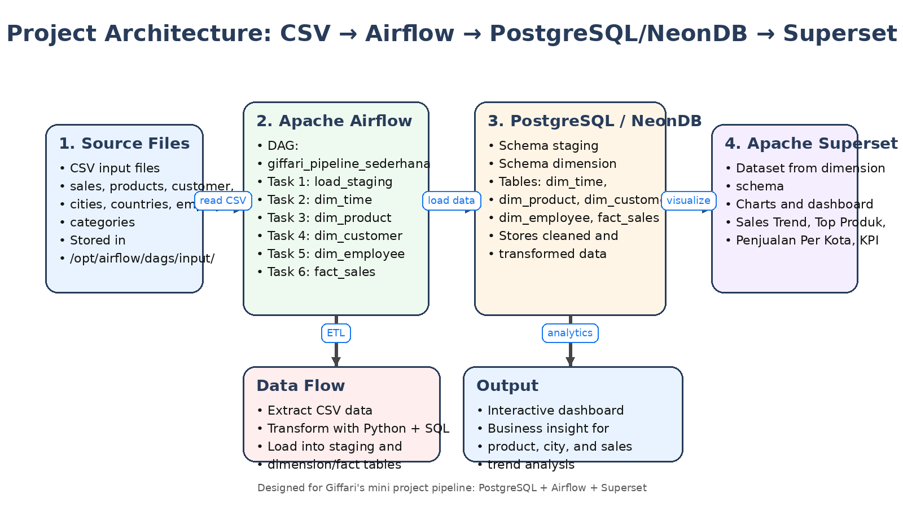
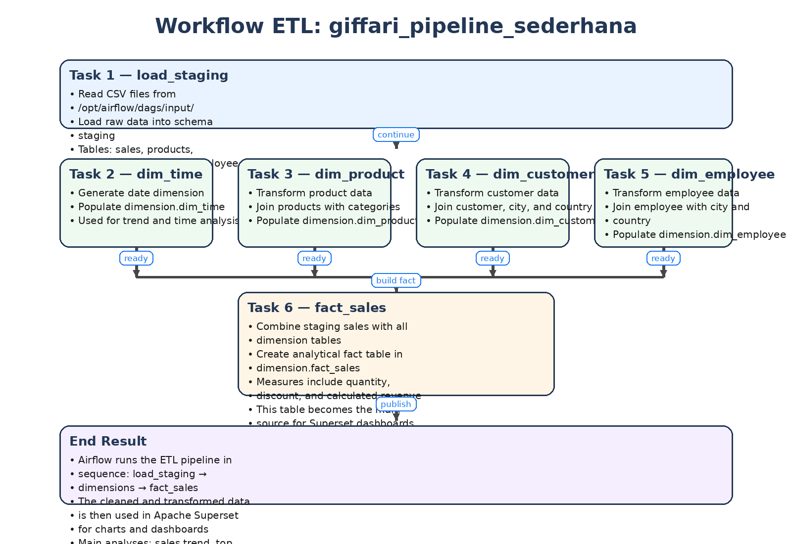

#  Mini Project Data Pipeline: PostgreSQL, Airflow, and Superset

##  Deskripsi Project
Project ini merupakan implementasi data pipeline end-to-end yang mencakup proses Extract, Transform, Load (ETL) menggunakan **Apache Airflow**, penyimpanan data menggunakan **PostgreSQL (NeonDB)**, serta visualisasi data menggunakan **Apache Superset**.

Tujuan dari project ini adalah untuk membangun sistem analisis penjualan yang dapat memberikan insight terkait performa produk, tren penjualan, dan distribusi pelanggan.

---

##  Tools & Teknologi
- PostgreSQL / NeonDB
- Apache Airflow
- Apache Superset
- Python (Pandas)
- SQL

---

##  Alur Sistem (Architecture)

### Penjelasan:
1. Data CSV digunakan sebagai sumber data awal
2. Airflow menjalankan proses ETL
3. Data disimpan ke PostgreSQL dalam bentuk staging dan data warehouse
4. Superset digunakan untuk membuat dashboard analitik

---

##  Workflow ETL

### Urutan proses:
1. **load_staging**
   - Load data CSV ke schema staging
2. **dim_time**
   - Membuat tabel waktu
3. **dim_product**
   - Transformasi data produk
4. **dim_customer**
   - Transformasi data pelanggan
5. **dim_employee**
   - Transformasi data pegawai
6. **fact_sales**
   - Menggabungkan semua data menjadi tabel fakta

---

##  Struktur Database

### Schema:
- `staging` → data mentah
- `dimension` → data warehouse

### Tabel:
- `dim_time`
- `dim_product`
- `dim_customer`
- `dim_employee`
- `fact_sales`

---

##  Dashboard Superset

Dashboard yang dibuat meliputi:

-  Sales Trend Over Time
-  Top Selling Products
-  Top Cities by Revenue
-  KPI (Total Revenue, Quantity, Average Revenue)

## 📂 Struktur Project
mini-project-pipeline/
│
├── README.md
├── .gitignore
│
├── sql/
│ ├── create_schema.sql
│ ├── staging_tables.sql
│ ├── dimension_tables.sql
│ └── fact_table.sql
│
├── airflow/
│ └── giffari_pipeline_sederhana.py
│
├── superset/
│ ├── dataset_query.sql
│ └── dashboard_screenshots/
│
├── docs/
│ ├── architecture_giffari_project.png
│ ├── workflow_giffari_project.png
│ └── erd.png
